# 프로젝트 이름 : 일촌뱅크

## 프로젝트 기간

- 2023.08.21 ~ 2023.10.06

## 프로젝트 소개

> 부모와 아이가 함께하는 금융 교육 플랫폼  
> 금융 퀴즈를 통해 쉽게 금융 지식에 접근  
> 자산 시각화로 금융 습관 및 성향 파악 및 교정  

## 👪 팀원 소개

<table>
    <tr>
        <td height="140px" align="center"> 
              👑 김동준  (Front-End/UX,UI)  </td>
        <td height="140px" align="center"> 
             🙂 박종민  (Back-End/Front-end)  </td>
        <td height="140px" align="center">
             😆 이동현  (Infra/Back-End)  </td>
        <td height="140px" align="center"> 
               😁 이원희  (Back-End/Front-End)  </td>
        <td height="140px" align="center"> 
              🙄 전현태  (Full-Stack)  </td>
        <td height="140px" align="center"> 
             😶 차건영  (Full-Stack)   </td>
    </tr>
</table>

 

## 주요 기능

- 금융상품 구현 (예금, 적금, 대출)
- AmCharts를 사용한 계좌 정보 시각화
- 백엔드 스케쥴러를 사용하여 이자, 이율 자동 및 즉시 계산
- chatGPT API를 활용한 금융 퀴즈
- Rabbit MQ를 활용한 웹 푸시 기능
- 미션을 활용한 Gamification

 

## 차별성

- ChatGPT API의 정제된 응답을 받기 위해 System등 재 가공하여 응답 받음
- ChatGPT API정기적 응답을 위해 Scheduled와 시작시 생성을 위해 PostConstruct 사용
- 예금, 적금, 대출, 가족 요청, 승인 시 웹 푸시 알림 기능(오프라인에서도 가능)
- AmCarts로 각 금융 비율 당 시각화
- 스케쥴러를 사용하여 예금, 적금, 정기용돈, 문제 갱신, 이자율 동시 계산

 

## 🗂️ 시스템 아키텍처

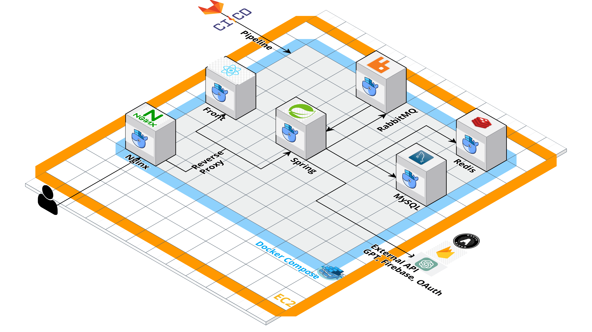

 

## 🛠️ 기술 스택

|        JavaScript         |          Redux          |          React          |         Node          |            Spring Boot             |           Spring Security            |            GitLab CI/CD            |          Docker           |          Redis          |         Spring Data Jpa         |          NginX          |          MySQL          |         EC2         |           RabbitMQ            |         FCM         |
| :-----------------------: | :---------------------: | :---------------------: | :-------------------: | :--------------------------------: | :----------------------------------: | :--------------------------------: | :-----------------------: | :---------------------: | :-----------------------------: | :---------------------: | :---------------------: | :-----------------: | :---------------------------: | :-----------------: |
|  |  |  |  |  |  |  |  |  |  |  |  |  |  |  |

 

## 개발환경 및 라이브러리

|       Category       | Details                                                                         |
| :------------------: | :------------------------------------------------------------------------------ |
|        **DB**        | MySQL, Redis                                                                    |
|    **Front-end**     | React: 18.2.0, React-redux: 8.1.2, firebase: 18.2.0, sass: 1.68.0, axios: 1.5.0 |
|     **Back-end**     | Spring Boot: 2.7.16, Java: 11, RabbitMQ: 3.8.11, QueryDSL                       |
|      **Infra**       | AWS EC2, Docker                                                                 |
| **External program** | Firebase Cloud Messaging, ChatGPT API, Oauth2.0                                 |

 

## 시연 순서

0. 홈 화면에서 시작
1. `카카오톡` 혹은 `구글` 로 부모와 자녀로 로그인
2. 부모로 가족을 `생성` 및 자녀 초대(가족이 없으면 상품 등을 방문할 수 없음)
3. 자녀가 가족 초대 `수락`(자녀는 초대가 없으면 초대가 없다고 나옴), 부모가 `용돈 주기`
4. 부모가 자녀를 위한 `미션 생성`
5. 자녀 `미션 수락`
6. `미션 거절`까지 보여주기
7. 오늘의 `퀴즈 풀기`+ 재접속으로 막힌것 까지 보기
8. 부모가 `금융상품 만들기`
9. 자녀 `금융상품 요청`
10. 부모의 `금융상품 수락`
11. 부모의 자녀 별 `금액 비율 및 상태 보기`
12. 부모는 자녀가 가입한 `상품 보기`
13. 자녀의 `금액 비율 및 상태 보기`

 

## 서비스 화면

### 로그인 화면

### 로그인

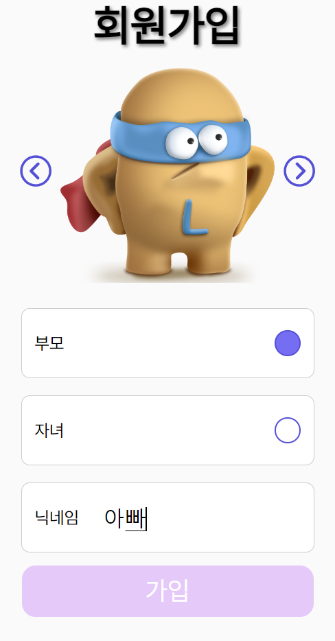

### 메인 화면

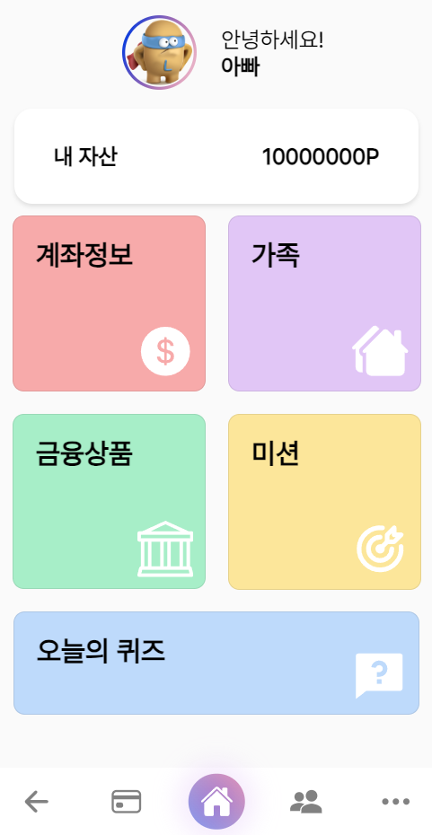

### 계좌 정보

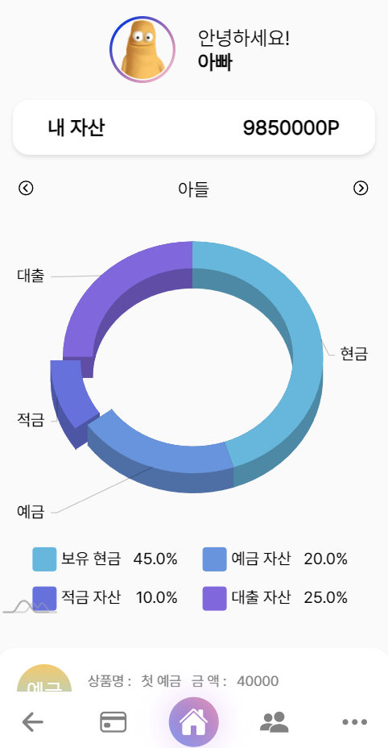

### 금융 상품

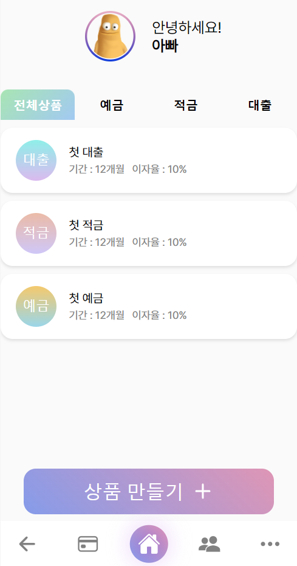

### 금융 상품 정보

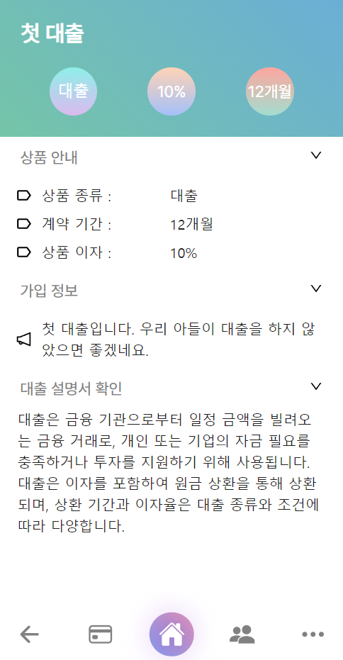

### 자녀 금융 상품 신청

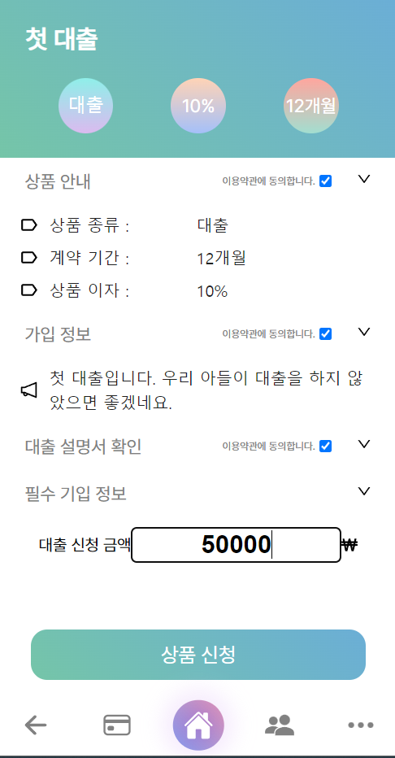

### 부모 금융 상품 수락

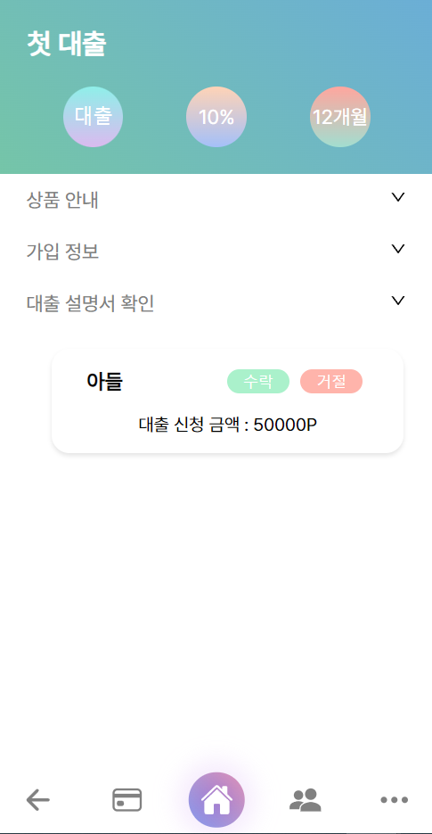

### GPT 퀴즈

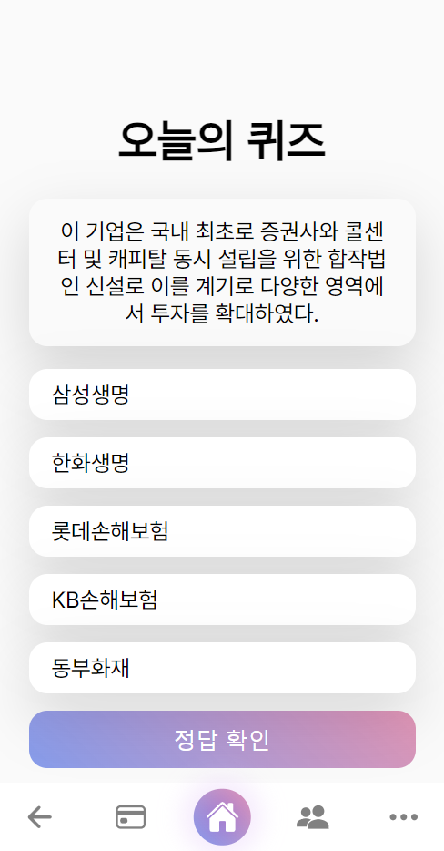

### GPT 정답

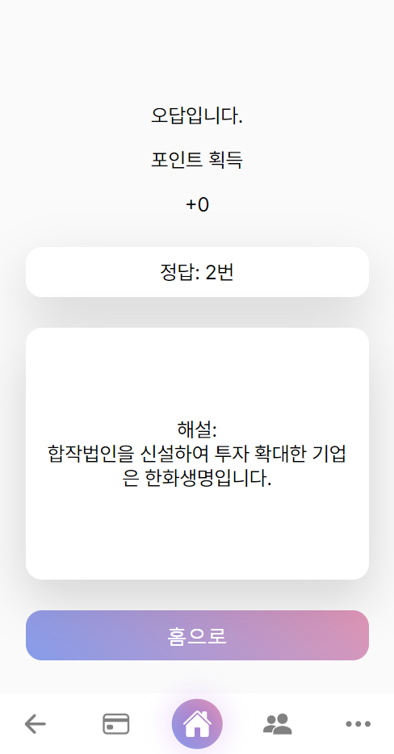

### 웹 푸시

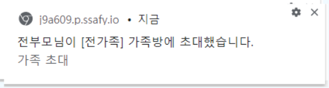

### 서비스 영상

